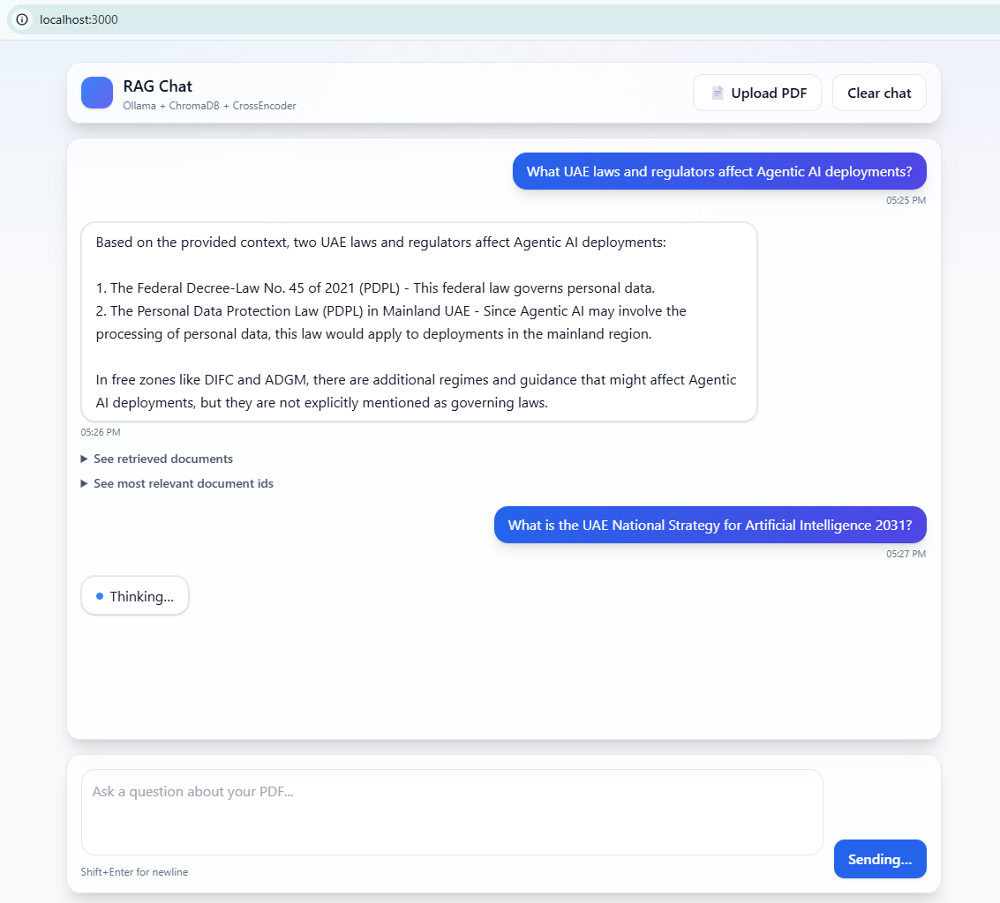

# FAQs RAG Chatbot Embedding Rerank View (Node.js + Next.js 14 + Python + FastAPI + Ollama + ChromaDB)

FAQs local chat UI (**Next.js 14 App Router**) backed by a secure **FastAPI** service.  
Upload PDFs → embed with **Ollama** (`nomic-embed-text`) → store in **ChromaDB** → **CrossEncoder** re-rank → answer via **`llama3.2:3b`** strictly from retrieved context.

> **Offline note:** First run needs internet to cache the CrossEncoder. After that, everything runs fully offline (models + cache are local).

---





## ✨ Features

- 📄 **PDF → text → chunks** (size **400**, overlap **100**)
- 🧭 **Semantic search** on **ChromaDB** (persistent at `./demo-rag-chroma`)
- 🧠 **Re-ranking** with `cross-encoder/ms-marco-MiniLM-L-6-v2` (top-3)
- 💬 **Grounded answers** with **Ollama** `llama3.2:3b` (context-only)
- 💾 **Chat thread UI** (Next.js) with Q&A persisted in **localStorage**
- 🔎 **JSON tree panels** in the UI:
  - **“See retrieved documents”** — JSON tree of the raw retrieval
  - **“See most relevant document ids”** — JSON tree of indices  
    _(with array **indexes**)_
- 🔐 **Secure backend** with API key (kept server-side via Next.js API routes)
- 🌐 **CORS** limited to allowed origins
- 📈 **Structured logging** & **global exception handlers** in the backend

---

## 🧱 Project Structure

```

root/
├── backend/
│   ├── app/
│   │   ├── init.py
│   │   ├── config.py                 # env/settings (LOG_LEVEL, LOG_JSON supported)
│   │   ├── deps.py                   # API-key dependency
│   │   ├── exceptions.py             # global error handlers (consistent JSON envelope)
│   │   ├── logging_config.py         # structured logging + request_id
│   │   ├── models.py                 # pydantic DTOs
│   │   ├── routers/
│   │   │   ├── ask.py                # POST /v1/ask (returns answer + retrieved + reranked_ids + retrieval)
│   │   │   └── ingest.py             # POST /v1/ingest (PDF upload)
│   │   └── services/
│   │       ├── document_processing.py# PDF -> chunks
│   │       ├── llm.py                # call Ollama chat
│   │       ├── rerank.py             # CrossEncoder top-3
│   │       └── vector_store.py       # Chroma get/upsert/query
│   ├── main.py                       # FastAPI app + CORS + middleware + handlers
│   ├── requirements.txt
│   └── .env.example
└─ frontend/
├── app/
│   ├── api/
│   │   ├── ask/route.ts          # proxies to backend /v1/ask (adds x-api-key)
│   │   └── ingest/route.ts       # proxies to backend /v1/ingest
│   ├── globals.css
│   ├── layout.tsx
│   └── page.tsx                  # Chat page
├── components/
│   ├── Chat.tsx
│   ├── Composer.tsx
│   ├── FileUploader.tsx
│   ├── MessageList.tsx
│   └── JsonTree.tsx              # JSON viewer (with array index display)
├── lib/
│   ├── storage.ts                # localStorage thread
│   └── types.ts                  # includes AskResponse.retrieval
├── next.config.js
├── package.json
├── postcss.config.js
├── tailwind.config.ts
└── tsconfig.json

```

---

## ✅ Prerequisites

- **Python** 3.9–3.11
- **Node.js** 18+
- **Ollama** running at `http://localhost:11434`
- **Git**
- One-time internet to cache CrossEncoder on first run

---

## 1) Clone the repo

```bash
git clone https://github.com/yourname/faq-rag-chat-nextjs-embedding-rerank-view.git
cd faq-rag-chat-nextjs-embedding-rerank-view
```

---

## 2) Backend — install & run

### 2.1 Create venv and install deps

```bash
cd backend
python -m venv .venv

# Windows PowerShell
.venv\Scripts\Activate.ps1

# macOS/Linux
source .venv/bin/activate


pip install -r requirements.txt
```

**`backend/requirements.txt` should include:**

```
fastapi==0.115.0
uvicorn[standard]==0.30.6
python-multipart==0.0.12
pydantic==2.8.2
pydantic-settings==2.4.0
chromadb==0.5.20
ollama==0.4.3
sentence-transformers==3.3.1
pymupdf==1.24.14
langchain-community==0.3.7
langchain-core>=0.3.0,<0.4.0
langchain-text-splitters>=0.3.0,<0.4.0
```

### 2.2 Configure environment

```bash
cp .env.example .env
# Edit .env:
# API_KEY=change-me
# ALLOWED_ORIGINS=http://localhost:3000
# OLLAMA_BASE_URL=http://localhost:11434
# CHROMA_PATH=./demo-rag-chroma
# EMBED_MODEL=nomic-embed-text:latest
# CHAT_MODEL=llama3.2:3b
# MAX_UPLOAD_MB=20
# LOG_LEVEL=INFO
# LOG_JSON=false
```

### 2.3 Start Ollama & pull models

```bash
# In a separate terminal:
ollama serve

# Pull models used by the app:
ollama pull llama3.2:3b
ollama pull nomic-embed-text:latest

# Verify API is up:
curl http://localhost:11434/api/tags
```

> If you plan to be fully offline, run once with internet so CrossEncoder can cache:
>
> ```python
> from sentence_transformers import CrossEncoder
> CrossEncoder("cross-encoder/ms-marco-MiniLM-L-6-v2")
> ```

### 2.4 Run the backend API

```bash
uvicorn main:app --reload --port 8000
```

Backend now at: **[http://localhost:8000](http://localhost:8000)**

---

## 3) Frontend — install & run (Next.js 14)

```bash
cd ../frontend
npm install
```

Create `.env.local`:

```bash
cat > .env.local <<'ENV'
NEXT_PUBLIC_APP_ORIGIN=http://localhost:3000
BACKEND_URL=http://localhost:8000
BACKEND_API_KEY=change-me
ENV
```

Run the dev server:

```bash
npm run dev
```

Frontend now at: **[http://localhost:3000](http://localhost:3000)**

---

## 4) Use the app

1. Click **📄 Upload PDF** → choose a PDF → wait for “Ingested … chunks”.
2. Type your question → **Send**.
3. The assistant’s answer appears; your Q\&A persists in **localStorage**.
4. Expand:

   - **See retrieved documents** → shows raw retrieval as a JSON tree
     (arrays display with **indexes** `0,1,2…` for readability)
   - **See most relevant document ids** → shows indices chosen by the re-ranker

5. Use **Clear chat** to reset the local thread.

---

## 5) API Reference

### Frontend proxy routes

- **POST** `/api/ingest` — multipart form with `file: PDF`
  → Proxies to backend `/v1/ingest` and adds `x-api-key` server-side
- **POST** `/api/ask` — JSON `{ "question": string }`
  → Proxies to backend `/v1/ask`

### Backend endpoints

- **POST** `/v1/ingest` — headers: `x-api-key: <API_KEY>`

  - Returns `{ "message", "file_name", "chunks" }`

- **POST** `/v1/ask` — headers: `x-api-key: <API_KEY>`

  - **Returns**:

    ```json
    {
      "answer": "string",
      "retrieved": [["chunk text", "..."]],
      "reranked_ids": [2, 0, 1],
      "retrieval": {
        "ids": [["..."]],
        "documents": [["..."]],
        "distances": [[0.12, 0.23, "..."]],
        "included": ["distances", "documents", "metadatas"]
      }
    }
    ```

> The frontend renders `retrieval` (or falls back to `{ documents: retrieved }`) in a JSON tree.

---

## 6) How it works (pipeline)

1. **Ingest**

   - PDF → temp file → **PyMuPDF** parse → `RecursiveCharacterTextSplitter` (400/100).
   - Embeddings with **Ollama** (`nomic-embed-text`) → upsert to **ChromaDB** at `./demo-rag-chroma`.

2. **Ask**

   - Chroma returns top-k (default 10) candidate chunks for the question.

3. **Re-rank**

   - `cross-encoder/ms-marco-MiniLM-L-6-v2` ranks candidates → pick **top-3**, concatenate as **context**.

4. **Answer**

   - **Ollama** runs `llama3.2:3b` with a strict system prompt → answer **only** from context.
   - UI displays answer + the two JSON tree panels.

---

## 7) Observability & Errors

- **Structured logging** (`logging_config.py`) with `request_id`, latency, method, path.
  Configure via `.env`: `LOG_LEVEL=DEBUG|INFO|...`, `LOG_JSON=true|false`.
- **Global exception handlers** (`exceptions.py`) return a consistent JSON envelope:

  ```json
  {
    "status": "error",
    "code": "validation_error",
    "message": "Invalid request.",
    "details": [ ... ],
    "request_id": "…",
    "timestamp": "…"
  }
  ```

---

## 8) Troubleshooting

- **Cannot connect to Ollama**

  - `ollama serve` then `curl http://localhost:11434/api/tags`
  - Ensure port **11434** is free.

- **No answer or empty retrieval**

  - Ingest a PDF first; ensure your question is present in the document.

- **CrossEncoder fails offline on first run**

  - Run once with internet to cache the model.

- **Reset vector DB**

  ```bash
  # stop backend first
  rm -rf backend/demo-rag-chroma
  mkdir backend/demo-rag-chroma
  ```

- **CORS errors**

  - Ensure `ALLOWED_ORIGINS` in backend `.env` includes `http://localhost:3000`.

---

## 9) Customize

- **Models**: `backend/app/config.py` (`EMBED_MODEL`, `CHAT_MODEL`)
- **Chunking**: `backend/app/services/document_processing.py`
- **Retrieval size**: `backend/app/services/vector_store.py` (`n_results`)
- **UI styling**: Tailwind in `frontend/app/globals.css` and components
- **Panels**: JSON viewer component `JsonTree.tsx` (shows array indexes)

---

## 10) Quick Commands (copy/paste)

```bash
# backend
cd backend
python -m venv .venv && source .venv/bin/activate
pip install -r requirements.txt
cp .env.example .env
uvicorn main:app --reload --port 8000
```

```bash
# frontend
cd ../frontend
npm install
echo 'NEXT_PUBLIC_APP_ORIGIN=http://localhost:3000
BACKEND_URL=http://localhost:8000
BACKEND_API_KEY=change-me' > .env.local
npm run dev
```

```bash
# ollama (separate terminal)
ollama serve
ollama pull llama3.2:3b
ollama pull nomic-embed-text:latest
curl http://localhost:11434/api/tags
```

---

Happy building! 🚀
